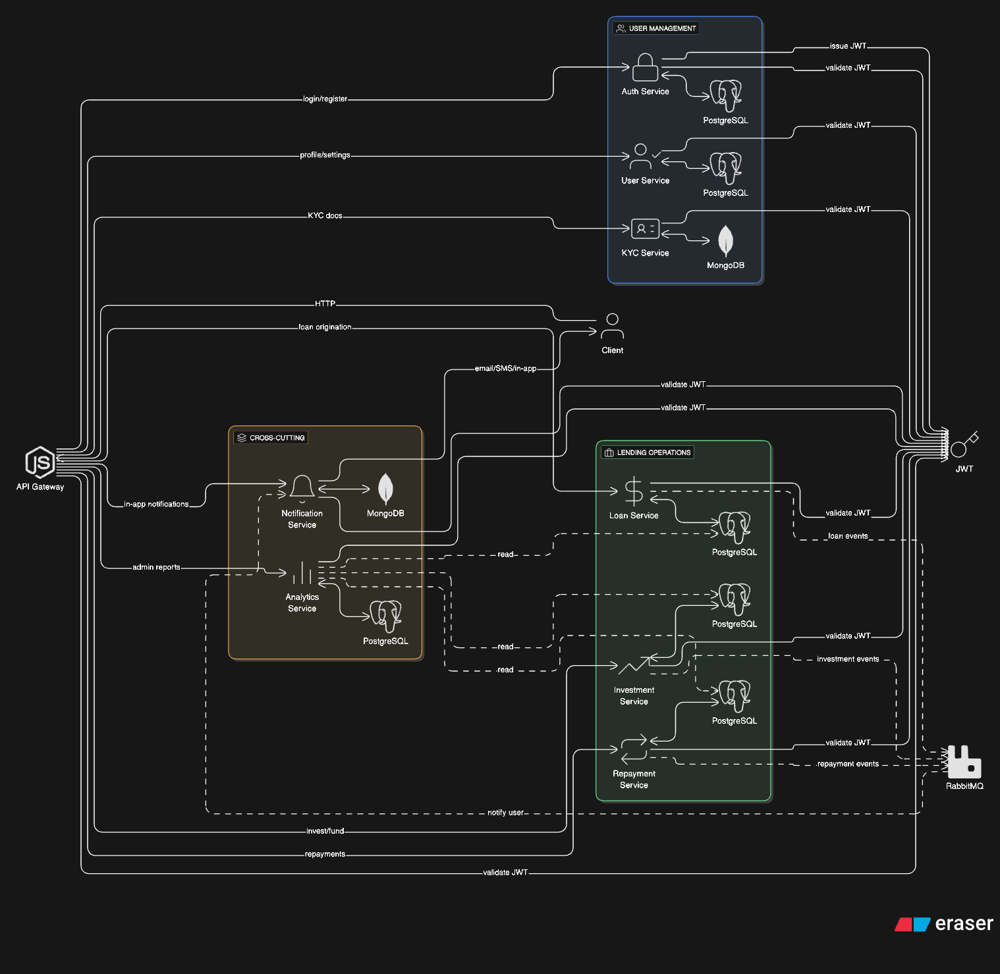

# p2p-lending-services

To develop the **core features** of your **P2P Lending Platform** step by step, here's a **developer-oriented roadmap** broken down by key modules.

---

## System architecture

---

## 🧱 **Phase 1: Project Foundation**

### ✅ Tasks

* **Tech Stack Setup**

  * Frontend: React, Next.js
  * Backend: NestJS, Prisma
  * Database: PostgreSQL, MongoDB, Redis
  * Messaging: RabbitMQ
  * Monitoring:  Grafana
  * CI/CD: GitHub Actions, Vercel, Docker
  * Logging: NestJS Logger
  * Testing: Jest, Supertest
  * Documentation: Swagger, Postman
* **Auth & Roles**
  * User Authentication (JWT/Session)
  * Role-based access: Borrower, Lender, Admin

---

## 🔐 **Phase 2: KYC & User Identity Module**

### 🧩 Core Features

* User Registration
* Upload ID Card / Passport
* Store scanned documents (Cloudinary, S3, or local)
* Admin panel for **manual KYC approval**

### 🔧 Tech Steps

* Use file upload API with storage (e.g., `multer` + S3)
* Store user KYC status in DB: `PENDING`, `VERIFIED`, `REJECTED`
* Admin dashboard to review KYC docs

---

## 💰 **Phase 3: Loan Origination & Credit System**

### 🧩 Core Features

* Loan request form: amount, term, purpose
* Auto-calculate monthly payments
* Credit Score Integration (optional mock or real API)
* Document attachment (proof of income, ID)

### 🔧 Tech Steps

* Create `loans` table with user\_id, status, and metadata
* Build calculator logic on frontend using amortization formula
* Credit score can be faked with internal rules:

  * Employment + Income + History = Score (out of 100)
* Admin validates and moves request to “listing”

---

## 📊 **Phase 4: Loan Listings & Investment Flow**

### 🧩 Core Features

* Display all active loan listings (with credit score, loan details)
* Lenders can fund full or partial amounts
* Update funding progress in real-time (Socket.io or polling)

### 🔧 Tech Steps

* `investments` table: lender\_id, loan\_id, amount
* Validate no overfunding
* Update loan `funded_amount` until it reaches `requested_amount`
* Once fully funded → change status to `ACTIVE`

---

## 💸 **Phase 5: Payment & Repayment System**

### 🧩 Core Features

* Auto-payment by borrowers (via schedule)
* Repayment dashboard for both parties
* Late payment notifications & penalties

### 🔧 Tech Steps

* Schedule repayments using cron jobs or workers
* Integration with payment gateway (VNPay, Stripe, MoMo)
* Add `repayments` table: due\_date, amount, paid\_status
* Lenders receive calculated interest per installment

---

## 📣 **Phase 6: Messaging & Notification System**

### 🧩 Core Features

* Email / in-app notifications
* Alerts for payment due, KYC result, investment changes

### 🔧 Tech Steps

* Use NodeMailer or SendGrid for emails
* Use database-triggered events or message queue (RabbitMQ) for notifications
* Create notification UI component (bell icon)

---

## 🧑‍💼 **Phase 7: Dashboard (All Roles)**

### 🧩 Core Features

* **Borrower:** Loan status, repayment schedule
* **Lender:** Portfolio summary, returns
* **Admin:** User stats, platform analytics

### 🔧 Tech Steps

* Use chart libraries (Chart.js, Recharts) for data visualization
* Fetch data using paginated and filtered APIs
* Admin dashboard with toggles for KYC, loans, users

---

## 🛡️ **Phase 8: Security, Roles & Audits**

### 🧩 Core Features

* Role-based route guards
* Encrypted documents & sensitive data
* Activity logs for audit (Admin only)

---

## 📈 **Phase 9: Reporting & Analytics**

### 🧩 Core Features

* User transaction history
* Platform-wide stats (total invested, total repaid)
* Export CSV / PDF reports

---

## 📝 Summary Table

| Phase | Feature Area              | Main Modules                            |
| ----- | ------------------------- | --------------------------------------- |
| 1     | Setup                     | Auth, Roles, CI/CD                      |
| 2     | KYC                       | ID Verification, Admin Approval         |
| 3     | Loan Origination          | Calculator, Score, Document Upload      |
| 4     | Loan Listing & Investment | Funding Flow, Filtering, Matching       |
| 5     | Repayment Management      | Schedule, Auto-pay, Gateway Integration |
| 6     | Notifications             | Email, In-App, Late Payment Alerts      |
| 7     | Dashboards                | Role-based UI, Recharts                 |
| 8     | Security & Roles          | RBAC, Encryption, Logging               |
| 9     | Reporting                 | Export, Analytics, Graphs               |

---

Let me know if you want:

* A **backend API structure**
* A **full database schema**
* Or a **Figma UI layout for all user roles**

I can help build those next.

| 🧩 Service           | 📦 Tables                         | 🔁 Events Emitted                        | 🔄 Events Consumed                 |
| -------------------- | --------------------------------- | ---------------------------------------- | ---------------------------------- |
| **Auth Service**     | `users`, `user_roles`, `sessions` | `user.created`, `user.updated`           | *N/A*                              |
| **User Service**     | `user_profiles`, `addresses`      | `user.profile.updated`                   | `user.created`                     |
| **Order Service**    | `orders`, `order_items`, `cart`   | `order.created`, `order.cancelled`       | `user.created`, `payment.success`  |
| **Payment Service**  | `payments`, `transactions`        | `payment.success`, `payment.failed`      | `order.created`                    |
| **Shipping Service** | `shipments`, `tracking_events`    | `shipment.created`, `shipment.delivered` | `payment.success`, `order.created` |