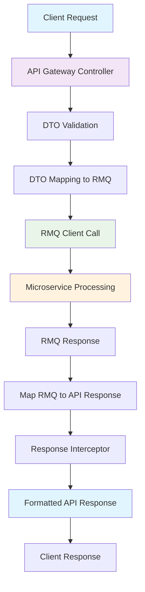

# API Gateway Structure - Clean Implementation

## 🎯 **Overview**

This document outlines the clean, organized structure for the API Gateway that provides clear separation between external API interfaces and internal RMQ communication.

## 📁 **Directory Structure**

```
apps/api-gateway/src/
├── dtos/                           # Data Transfer Objects
│   ├── common.dto.ts              # Common response DTOs and pagination
│   ├── index.ts                   # Export all DTOs
│   ├── auth/                      # Authentication DTOs
│   │   ├── index.ts              # Auth DTO exports
│   │   ├── register.dto.ts       # Auth request DTOs
│   │   ├── response.dto.ts       # Auth response DTOs
│   │   └── verify-otp.dto.ts     # OTP verification DTO
│   └── user/                      # User DTOs
│       ├── create-user.dto.ts    # User request DTOs
│       └── update-user.dto.ts    # User update DTO
├── utils/                         # Utility functions
│   └── dto-mappers.ts            # DTO mapping utilities
├── interceptors/                  # Response interceptors
│   └── response-format.interceptor.ts
├── routes/                        # API route controllers
│   └── auth/
│       └── auth.controller.ts    # Clean auth controller
└── clients/                       # RMQ client services
    ├── auth.client.ts
    ├── user.client.ts
    └── base.client.ts
```

## 🔧 **Key Components**

### **1. Common Response Structure**

All API responses follow a standardized format:

```typescript
// Success Response
{
  "success": true,
  "data": { /* actual response data */ },
  "message": "Operation completed successfully",
  "timestamp": "2024-01-01T00:00:00Z",
  "path": "/api/auth/register"
}

// Error Response
{
  "success": false,
  "statusCode": 400,
  "message": "Validation failed",
  "errorCode": "VALIDATION_ERROR",
  "details": { /* error details */ },
  "timestamp": "2024-01-01T00:00:00Z",
  "path": "/api/auth/register"
}
```

### **2. DTO Separation**

- **API DTOs**: External interface (validation, Swagger docs)
- **RMQ Interfaces**: Internal service communication
- **Mappers**: Convert between API DTOs and RMQ interfaces

### **3. Clean Controllers**

Controllers now have:
- ✅ Proper error handling
- ✅ Type safety with DTOs
- ✅ Swagger documentation
- ✅ Structured logging
- ✅ Response formatting

## 📝 **Usage Examples**

### **API Request DTO**

```typescript
export class ApiRegisterRequestDto {
  @ApiProperty({
    description: 'User email address',
    example: 'user@example.com',
  })
  @IsEmail()
  @IsNotEmpty()
  email: string;

  @ApiProperty({
    description: 'User password (minimum 6 characters)',
    example: 'SecurePassword123!',
  })
  @IsString()
  @IsNotEmpty()
  @MinLength(6)
  password: string;
  
  // ... other fields
}
```

### **DTO Mapping**

```typescript
export class DtoMappers {
  static mapApiRegisterToRmqRegister(apiDto: ApiRegisterRequestDto): RegisterRequest {
    return {
      id: '', // Generated by service
      email: apiDto.email,
      password: apiDto.password,
      firstName: apiDto.firstName,
      lastName: apiDto.lastName,
      dateOfBirth: new Date(apiDto.dateOfBirth),
      phone: apiDto.phone,
      address: apiDto.address,
      city: apiDto.city,
      country: apiDto.country,
    };
  }
}
```

### **Clean Controller**

```typescript
@ApiTags('Authentication')
@Controller('auth')
export class AuthController {
  @Post('register')
  @ApiOperation({ summary: 'User registration' })
  @ApiResponse({
    status: 201,
    description: 'Registration successful',
    type: ApiResponseDto<ApiRegisterResponseDto>,
  })
  async register(
    @Body(new ValidationPipe()) registerDto: ApiRegisterRequestDto,
    @Req() req: Request,
  ): Promise<ApiResponseDto<ApiRegisterResponseDto>> {
    try {
      // Map API DTO to RMQ request
      const rmqRegisterRequest = DtoMappers.mapApiRegisterToRmqRegister(registerDto);

      // Create user via RMQ
      const userResponse = await this.userClient.createUser(rmqRegisterRequest);
      
      // Register with auth service  
      const authResponse = await this.authClient.register(rmqRegisterRequest);

      // Map to API response
      const apiResponse = DtoMappers.mapRmqRegisterResponseToApiRegisterResponse(
        authResponse,
        userResponse,
      );

      return new ApiResponseDto(apiResponse, 'Registration successful', req.url);
    } catch (error) {
      this.logger.error(`Registration failed for email: ${registerDto.email}`, error);
      throw error; // Global exception filter handles this
    }
  }
}
```

## 🚀 **Benefits**

### **1. Clear Separation of Concerns**
- **API Layer**: External interface, validation, documentation
- **Service Layer**: Business logic and RMQ communication
- **Data Layer**: Database operations

### **2. Type Safety**
- Strong typing across all layers
- Compile-time error checking
- Better IDE support and autocomplete

### **3. Maintainability**
- Organized file structure
- Single responsibility principle
- Easy to add new endpoints

### **4. Documentation**
- Auto-generated Swagger docs
- Consistent API responses
- Clear examples and descriptions

### **5. Error Handling**
- Standardized error format
- Proper HTTP status codes
- Detailed error information

## 🔄 **Request/Response Flow**



## 📋 **Migration Checklist**

- ✅ **Common DTOs**: Standardized response structure
- ✅ **Auth DTOs**: Clean API request/response DTOs
- ✅ **User DTOs**: Organized user-related DTOs
- ✅ **DTO Mappers**: Utility functions for conversion
- ✅ **Controllers**: Updated with proper structure
- ✅ **Response Interceptor**: Consistent response formatting
- ✅ **Documentation**: Swagger annotations
- ✅ **Error Handling**: Standardized error responses

## 🔮 **Next Steps**

1. **Global Exception Filter**: Implement centralized error handling
2. **Response Interceptor Integration**: Apply to all controllers
3. **User Routes**: Apply same pattern to user endpoints
4. **Validation Pipes**: Custom validation for complex scenarios
5. **Rate Limiting**: Add API rate limiting
6. **Authentication Guards**: Implement JWT guards
7. **API Versioning**: Prepare for future API versions

## 🎉 **Result**

Your API Gateway now has:
- **Clean architecture** with proper separation
- **Type-safe** request/response handling
- **Consistent** API responses
- **Comprehensive** Swagger documentation
- **Maintainable** code structure
- **Scalable** foundation for future features

The structure follows .NET best practices and provides a solid foundation for your P2P lending platform! 🚀