# P2P Lending Platform - User Authentication & Service Communication Flow

## Overview

This document outlines the authentication flow and communication patterns between the API Gateway, User Service, and Auth Service using RabbitMQ as the message broker in the P2P Lending platform.

## Architecture Components

### Services
- **API Gateway** (Port 3000) - Entry point for all client requests
- **Auth Service** (Port 3001) - Handles authentication, JWT tokens, and password management
- **User Service** (Port 3002) - Manages user profiles and user-related data
- **RabbitMQ** (Port 5672) - Message broker for inter-service communication

### Databases
- **Auth Database** - PostgreSQL database storing authentication data
- **User Database** - PostgreSQL database storing user profile data

### Message Queues
- **auth_queue** - Routes messages to Auth Service
- **user_queue** - Routes messages to User Service

## System Architecture Diagram

```mermaid
---
title: P2P Lending - User Authentication Flow with RabbitMQ
---
graph TD
    %% External Entities
    Client[📱 Client Application]
    
    %% API Gateway
    Gateway[🌐 API Gateway<br/>Port: 3000]
    
    %% RabbitMQ
    RMQ[🐰 RabbitMQ Message Broker<br/>Port: 5672]
    
    %% Microservices
    AuthService[🔐 Auth Service<br/>Port: 3001]
    UserService[👤 User Service<br/>Port: 3002]
    
    %% Databases
    AuthDB[(🗄️ Auth Database<br/>PostgreSQL)]
    UserDB[(🗄️ User Database<br/>PostgreSQL)]
    
    %% Queues
    AuthQueue[auth_queue]
    UserQueue[user_queue]
    
    %% === USER REGISTRATION FLOW ===
    subgraph " 📝 User Registration Flow"
        direction TB
        R1[1. POST /auth/register<br/>RegisterDto: email, password,<br/>firstName, lastName, phone, role]
        R2[2. Send: user.create<br/>CreateUserRequest]
        R3[3. Create User Record<br/>Generate User ID]
        R4[4. Send: auth.register<br/>RegisterRequest + userId]
        R5[5. Create Auth Record<br/>Hash Password]
        R6[6. Generate JWT Tokens<br/>Access + Refresh]
        R7[7. Return UserAuthResponseDto<br/>Set Refresh Token Cookie]
    end
    
    %% === USER LOGIN FLOW ===
    subgraph " 🔑 User Login Flow"
        direction TB
        L1[1. POST /auth/login<br/>LoginDto: email, password]
        L2[2. Send: auth.login<br/>LoginRequest]
        L3[3. Validate Credentials<br/>Check Password Hash]
        L4[4. Generate JWT Tokens<br/>Access + Refresh]
        L5[5. Send: user.get_by_id<br/>Get User Profile]
        L6[6. Return User Profile<br/>Combined Auth + User Data]
        L7[7. Return UserAuthResponseDto<br/>Set Refresh Token Cookie]
    end
    
    %% === TOKEN VALIDATION FLOW ===
    subgraph " ✅ Token Validation Flow"
        direction TB
        V1[1. Protected Route Request<br/>Authorization: Bearer token]
        V2[2. AuthGuard Middleware<br/>Extract JWT Token]
        V3[3. Send: auth.validate_token<br/>ValidateTokenRequest]
        V4[4. Verify JWT Signature<br/>Check Expiration]
        V5[5. Return Validation Result<br/>+ User Payload]
        V6[6. Allow/Deny Request<br/>Based on Validation]
    end
    
    %% === TOKEN REFRESH FLOW ===
    subgraph " 🔄 Token Refresh Flow"
        direction TB
        T1[1. POST /auth/refresh-token<br/>Refresh Token from Cookie]
        T2[2. Send: auth.refresh_token<br/>RefreshTokenRequest]
        T3[3. Validate Refresh Token<br/>Check Database Record]
        T4[4. Generate New Tokens<br/>Access + Refresh]
        T5[5. Update Token Record<br/>Revoke Old Tokens]
        T6[6. Return New Access Token<br/>Update Cookie]
    end
    
    %% === LOGOUT FLOW ===
    subgraph " 🚪 User Logout Flow"
        direction TB
        O1[1. POST /auth/logout<br/>Refresh Token from Cookie]
        O2[2. Send: auth.logout<br/>LogoutRequest]
        O3[3. Revoke Token Record<br/>Mark as Invalid]
        O4[4. Clear Refresh Cookie<br/>Return Success]
    end
    
    %% Connections
    Client --> Gateway
    Gateway --> RMQ
    RMQ --> AuthQueue
    RMQ --> UserQueue
    AuthQueue --> AuthService
    UserQueue --> UserService
    AuthService --> AuthDB
    UserService --> UserDB
    
    %% Styling
    classDef clientStyle fill:#e1f5fe,stroke:#01579b,stroke-width:2px
    classDef gatewayStyle fill:#f3e5f5,stroke:#4a148c,stroke-width:2px
    classDef serviceStyle fill:#e8f5e8,stroke:#1b5e20,stroke-width:2px
    classDef queueStyle fill:#fff3e0,stroke:#e65100,stroke-width:2px
    classDef dbStyle fill:#fce4ec,stroke:#880e4f,stroke-width:2px
    classDef rmqStyle fill:#fff8e1,stroke:#f57f17,stroke-width:2px
    
    class Client clientStyle
    class Gateway gatewayStyle
    class AuthService,UserService serviceStyle
    class AuthQueue,UserQueue queueStyle
    class AuthDB,UserDB dbStyle
    class RMQ rmqStyle
```



## Detailed Sequence Diagram

```mermaid
---
title: P2P Lending - Detailed Authentication Sequence with RabbitMQ Messages
---
sequenceDiagram
    participant C as 📱 Client
    participant G as 🌐 API Gateway
    participant R as 🐰 RabbitMQ
    participant U as 👤 User Service
    participant A as 🔐 Auth Service
    participant UDB as 🗄️ User DB
    participant ADB as 🗄️ Auth DB
    
    %% ========== USER REGISTRATION FLOW ==========
    Note over C,ADB: 📝 USER REGISTRATION FLOW
    
    C->>+G: POST /auth/register<br/>{email, password, firstName, lastName, phone, role}
    Note over G: Validate RegisterDto
    
    G->>+R: Send to user_queue<br/>MESSAGE: "user.create"<br/>Payload: CreateUserRequest
    R->>+U: Route to User Service
    U->>+UDB: INSERT user record
    UDB-->>-U: Return user {id, email, ...}
    U-->>-R: Return CreateUserResponse
    R-->>-G: User created successfully
    
    G->>+R: Send to auth_queue<br/>MESSAGE: "auth.register"<br/>Payload: RegisterRequest {userId, email, password}
    R->>+A: Route to Auth Service
    A->>+ADB: Hash password & INSERT auth record
    ADB-->>-A: Return auth user {id, userId, email, ...}
    A->>A: Generate JWT tokens<br/>(Access + Refresh)
    A->>+ADB: Store refresh token
    ADB-->>-A: Token stored
    A-->>-R: Return RegisterResponseMQ<br/>{userAuthCreated, tokenKey}
    R-->>-G: Auth registration complete
    
    G->>G: Set httpOnly cookie<br/>(refreshToken)
    G-->>-C: Return UserAuthResponseDto<br/>{user, accessToken}
    
    %% ========== USER LOGIN FLOW ==========
    Note over C,ADB: 🔑 USER LOGIN FLOW
    
    C->>+G: POST /auth/login<br/>{email, password}
    Note over G: Validate LoginDto
    
    G->>+R: Send to auth_queue<br/>MESSAGE: "auth.login"<br/>Payload: LoginRequest
    R->>+A: Route to Auth Service
    A->>+ADB: Validate credentials<br/>SELECT * FROM auth_users WHERE email
    ADB-->>-A: Return auth user record
    A->>A: Verify password hash
    A->>A: Generate new JWT tokens
    A->>+ADB: Store new refresh token
    ADB-->>-A: Token stored
    A-->>-R: Return LoginResponse<br/>{user: {id, email, isVerified}, tokens}
    R-->>-G: Login successful
    
    G->>+R: Send to user_queue<br/>MESSAGE: "user.get_by_id"<br/>Payload: userId
    R->>+U: Route to User Service
    U->>+UDB: SELECT user profile
    UDB-->>-U: Return user profile
    U-->>-R: Return UserResponse
    R-->>-G: User profile retrieved
    
    G->>G: Set httpOnly cookie<br/>(refreshToken)
    G-->>-C: Return UserAuthResponseDto<br/>{user: combined data, accessToken}
    
    %% ========== TOKEN VALIDATION FLOW ==========
    Note over C,ADB: ✅ TOKEN VALIDATION FLOW
    
    C->>+G: GET /protected-route<br/>Authorization: Bearer {accessToken}
    Note over G: AuthGuard extracts token
    
    G->>+R: Send to auth_queue<br/>MESSAGE: "auth.validate_token"<br/>Payload: {token}
    R->>+A: Route to Auth Service
    A->>A: Verify JWT signature<br/>Check expiration
    A-->>-R: Return {valid: true/false, payload}
    R-->>-G: Validation result
    
    alt Token is valid
        G->>G: Attach user to request
        G-->>C: Process protected route
    else Token is invalid
        G-->>-C: 401 Unauthorized
    end
    
    %% ========== TOKEN REFRESH FLOW ==========
    Note over C,ADB: 🔄 TOKEN REFRESH FLOW
    
    C->>+G: POST /auth/refresh-token<br/>Cookie: refreshToken
    Note over G: Extract refresh token from cookie
    
    G->>+R: Send to auth_queue<br/>MESSAGE: "auth.refresh_token"<br/>Payload: RefreshTokenRequest
    R->>+A: Route to Auth Service
    A->>+ADB: Validate refresh token<br/>Check if not revoked
    ADB-->>-A: Token validation result
    A->>A: Generate new token pair
    A->>+ADB: Update token record<br/>Revoke old tokens
    ADB-->>-A: Tokens updated
    A-->>-R: Return AuthTokens<br/>{accessToken, refreshToken}
    R-->>-G: New tokens generated
    
    G->>G: Update httpOnly cookie<br/>(new refreshToken)
    G-->>-C: Return new accessToken
    
    %% ========== LOGOUT FLOW ==========
    Note over C,ADB: 🚪 LOGOUT FLOW
    
    C->>+G: POST /auth/logout<br/>Cookie: refreshToken
    Note over G: Extract refresh token from cookie
    
    G->>+R: Send to auth_queue<br/>MESSAGE: "auth.logout"<br/>Payload: LogoutRequest
    R->>+A: Route to Auth Service
    A->>+ADB: Revoke refresh token<br/>Mark as invalid
    ADB-->>-A: Token revoked
    A-->>-R: Return LogoutResponse<br/>{success: true}
    R-->>-G: Logout successful
    
    G->>G: Clear refresh token cookie
    G-->>-C: Return success response
```



## Message Patterns

### Auth Service Messages
```typescript
MESSAGE_PATTERNS.AUTH = {
  VALIDATE_TOKEN: 'auth.validate_token',
  REFRESH_TOKEN: 'auth.refresh_token',
  REVOKE_TOKEN: 'auth.revoke_token',
  LOGIN: 'auth.login',
  LOGOUT: 'auth.logout',
  REGISTER: 'auth.register',
  VERIFY_OTP: 'auth.verify_otp',
  RESET_PASSWORD: 'auth.reset_password',
}
```

### User Service Messages
```typescript
MESSAGE_PATTERNS.USER = {
  CREATE: 'user.create',
  GET_BY_ID: 'user.get_by_id',
  GET_BY_EMAIL: 'user.get_by_email',
  UPDATE: 'user.update',
  DELETE: 'user.delete',
  LIST: 'user.list',
  VALIDATE_CREDENTIALS: 'user.validate_credentials',
  GET_PROFILE: 'user.get_profile',
  UPDATE_PROFILE: 'user.update_profile',
  VERIFY_IDENTITY: 'user.verify_identity',
}
```

## Request/Response Data Models

### Registration Flow

**RegisterDto (API Gateway Input)**
```typescript
{
  email: string;
  password: string;
  firstName: string;
  lastName: string;
  phone: string;
  role: RoleEnum; // BORROWER | LENDER | ADMIN
}
```

**CreateUserRequest (User Service)**
```typescript
{
  email: string;
  firstName: string;
  lastName: string;
  phone: string;
  role: RoleEnum;
}
```

**RegisterRequest (Auth Service)**
```typescript
{
  userId: string; // Generated by User Service
  email: string;
  password: string;
  firstName: string;
  lastName: string;
  phone: string;
  role: RoleEnum;
}
```

### Login Flow

**LoginDto (API Gateway Input)**
```typescript
{
  email: string;
  password: string;
}
```

**LoginResponse (Auth Service Output)**
```typescript
{
  user: {
    id: string;
    email: string;
    isVerified: boolean;
    emailVerifiedAt: Date | null;
    isActive: boolean;
  };
  tokens: {
    accessToken: string;
    refreshToken: string;
  };
}
```

### Token Validation

**ValidateTokenRequest**
```typescript
{
  token: string;
}
```

**Token Validation Response**
```typescript
{
  valid: boolean;
  payload?: {
    userId: string;
    email: string;
    role: RoleEnum;
    iat: number;
    exp: number;
  };
}
```

## Security Features

### JWT Token Strategy
- **Access Token**: Short-lived (15-30 minutes), used for API authentication
- **Refresh Token**: Long-lived (7 days), stored in httpOnly cookie, used to refresh access tokens
- **Token Rotation**: New refresh tokens generated on each refresh to prevent replay attacks

### Cookie Security
- **httpOnly**: Prevents XSS attacks by making cookies inaccessible to JavaScript
- **Secure**: Ensures cookies are only sent over HTTPS in production
- **SameSite**: Prevents CSRF attacks by controlling cross-site cookie behavior

### Password Security
- **BCrypt Hashing**: Passwords are hashed using bcrypt with salt rounds
- **No Plain Text Storage**: Passwords are never stored in plain text

## Error Handling

### RPC Exceptions
Services use RpcException for consistent error handling across microservices:

```typescript
throw new RpcException({
  message: 'User not found',
  statusCode: HttpStatus.NOT_FOUND,
});
```

### HTTP Status Codes
- **200**: Success
- **201**: Created (Registration)
- **400**: Bad Request (Validation errors)
- **401**: Unauthorized (Invalid credentials/tokens)
- **404**: Not Found (User/Resource not found)
- **409**: Conflict (User already exists)

## Queue Configuration

### RabbitMQ Queues
```typescript
enum RmqQueue {
  AUTH = 'auth_queue',
  USER = 'user_queue',
  LOAN = 'loan_queue',
  INVESTMENT = 'investment_queue',
  REPAYMENT = 'repayment_queue',
  NOTIFICATION = 'notification_queue',
  PAYMENT = 'payment_queue',
  REPORT = 'report_queue',
}
```

### Service Names
```typescript
enum RmqService {
  AUTH = 'AUTH_SERVICE',
  USER = 'USER_SERVICE',
  LOAN = 'LOAN_SERVICE',
  INVESTMENT = 'INVESTMENT_SERVICE',
  REPAYMENT = 'REPAYMENT_SERVICE',
  NOTIFICATION = 'NOTIFICATION_SERVICE',
  PAYMENT = 'PAYMENT_SERVICE',
  REPORT = 'REPORT_SERVICE',
}
```

## Database Schema

### Auth Service Tables
- **auth_users**: Authentication credentials and verification status
- **token_keys**: JWT refresh token storage and management

### User Service Tables
- **users**: User profile information and metadata
- **roles**: User role definitions and permissions

## Best Practices

### Message Patterns
1. Use descriptive, hierarchical naming (e.g., `service.action`)
2. Include both request and response type definitions
3. Implement proper error handling with RPC exceptions
4. Use correlation IDs for request tracing

### Security
1. Never expose sensitive data in logs
2. Implement proper token rotation
3. Use secure cookie settings in production
4. Validate all input data with DTOs
5. Implement rate limiting on authentication endpoints

### Performance
1. Use async/await for all RabbitMQ operations
2. Implement connection pooling for database operations
3. Cache frequently accessed user data
4. Monitor queue performance and implement dead letter queues

---

*This documentation provides a comprehensive overview of the authentication flow and inter-service communication patterns in the P2P Lending platform using RabbitMQ as the message broker.*
