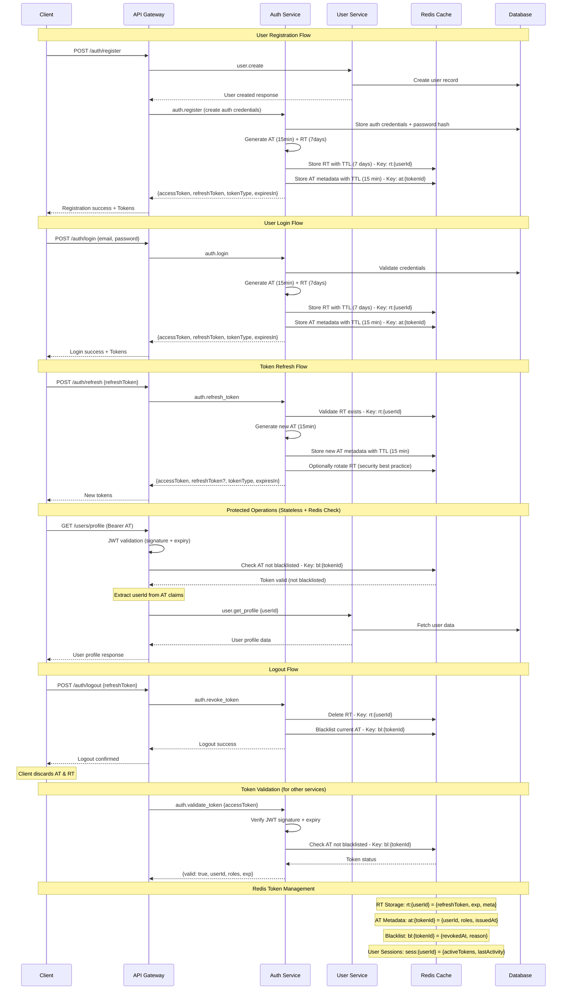

```mermaid
sequenceDiagram
    participant C as Client
    participant GW as API Gateway
    participant Auth as Auth Service
    participant User as User Service
    participant Redis as Redis Cache
    participant DB as Database

    Note over C,DB: User Registration Flow
    C->>GW: POST /auth/register
    GW->>User: user.create
    User->>DB: Create user record
    User-->>GW: User created response
    GW->>Auth: auth.register (create auth credentials)
    Auth->>DB: Store auth credentials + password hash
    Auth->>Auth: Generate AT (15min) + RT (7days)
    Auth->>Redis: Store RT with TTL (7 days) - Key: rt:{userId}
    Auth->>Redis: Store AT metadata with TTL (15 min) - Key: at:{tokenId}
    Auth-->>GW: {accessToken, refreshToken, tokenType, expiresIn}
    GW-->>C: Registration success + Tokens

    Note over C,DB: User Login Flow
    C->>GW: POST /auth/login {email, password}
    GW->>Auth: auth.login
    Auth->>DB: Validate credentials
    Auth->>Auth: Generate AT (15min) + RT (7days)
    Auth->>Redis: Store RT with TTL (7 days) - Key: rt:{userId}
    Auth->>Redis: Store AT metadata with TTL (15 min) - Key: at:{tokenId}
    Auth-->>GW: {accessToken, refreshToken, tokenType, expiresIn}
    GW-->>C: Login success + Tokens

    Note over C,DB: Token Refresh Flow
    C->>GW: POST /auth/refresh {refreshToken}
    GW->>Auth: auth.refresh_token
    Auth->>Redis: Validate RT exists - Key: rt:{userId}
    Auth->>Auth: Generate new AT (15min)
    Auth->>Redis: Store new AT metadata with TTL (15 min)
    Auth->>Redis: Optionally rotate RT (security best practice)
    Auth-->>GW: {accessToken, refreshToken?, tokenType, expiresIn}
    GW-->>C: New tokens

    Note over C,DB: Protected Operations (Stateless + Redis Check)
    C->>GW: GET /users/profile (Bearer AT)
    GW->>GW: JWT validation (signature + expiry)
    GW->>Redis: Check AT not blacklisted - Key: bl:{tokenId}
    Redis-->>GW: Token valid (not blacklisted)
    Note over GW: Extract userId from AT claims
    GW->>User: user.get_profile {userId}
    User->>DB: Fetch user data
    User-->>GW: User profile data
    GW-->>C: User profile response

    Note over C,DB: Logout Flow
    C->>GW: POST /auth/logout {refreshToken}
    GW->>Auth: auth.revoke_token
    Auth->>Redis: Delete RT - Key: rt:{userId}
    Auth->>Redis: Blacklist current AT - Key: bl:{tokenId}
    Auth-->>GW: Logout success
    GW-->>C: Logout confirmed
    Note over C: Client discards AT & RT

    Note over C,DB: Token Validation (for other services)
    GW->>Auth: auth.validate_token {accessToken}
    Auth->>Auth: Verify JWT signature + expiry
    Auth->>Redis: Check AT not blacklisted - Key: bl:{tokenId}
    Redis-->>Auth: Token status
    Auth-->>GW: {valid: true, userId, roles, exp}

    Note over C,DB: Redis Token Management
    Note over Redis: RT Storage: rt:{userId} = {refreshToken, exp, meta}
    Note over Redis: AT Metadata: at:{tokenId} = {userId, roles, issuedAt}
    Note over Redis: Blacklist: bl:{tokenId} = {revokedAt, reason}
    Note over Redis: User Sessions: sess:{userId} = {activeTokens, lastActivity}
```
