# P2P Lending Platform - Complete System Architecture & Business Flow

## Overview

This document outlines the complete architecture, business flows, and communication patterns for the P2P Lending Platform using NestJS microservices, RabbitMQ message broker, and PostgreSQL databases. The platform enables borrowers to apply for loans and investors to fund them through a secure, scalable marketplace.

## Architecture Components

### Services
- **API Gateway** (Port 3000) - Entry point for all client requests
- **Auth Service** (Port 3001) - Handles authentication, JWT tokens, and password management
- **User Service** (Port 3002) - Manages user profiles, KYC, and user-related data
- **Loan Service** (Port 3003) - Handles loan origination, management, and CQRS operations
- **Investment Service** (Port 3004) - Manages investment flows and investor portfolios
- **Payment Service** (Port 3005) - Processes payments, repayments, and fund transfers
- **Notification Service** (Port 3006) - Handles multi-channel notifications
- **RabbitMQ** (Port 5672) - Message broker for inter-service communication

### Databases
- **Auth Database** - PostgreSQL database storing authentication data
- **User Database** - PostgreSQL database storing user profile and KYC data
- **Loan Database** - PostgreSQL database storing loan applications and management data
- **Investment Database** - PostgreSQL database storing investment and portfolio data
- **Payment Database** - PostgreSQL database storing payment and transaction data
- **Notification Database** - MongoDB database storing notification logs and templates

### Message Queues
- **auth_queue** - Routes messages to Auth Service
- **user_queue** - Routes messages to User Service
- **loan_queue** - Routes messages to Loan Service
- **investment_queue** - Routes messages to Investment Service
- **payment_queue** - Routes messages to Payment Service
- **notification_queue** - Routes messages to Notification Service

## System Architecture Diagram

```mermaid
---
title: P2P Lending Platform - Complete System Architecture
---
graph TB
    %% External Entities
    Client[📱 Client Application]
    Admin[👨‍💼 Admin Dashboard]
    
    %% API Gateway
    Gateway[🌐 API Gateway<br/>Port: 3000]
    
    %% RabbitMQ
    RMQ[🐰 RabbitMQ Message Broker<br/>Port: 5672]
    
    %% Microservices
    AuthService[🔐 Auth Service<br/>Port: 3001]
    UserService[👤 User Service<br/>Port: 3002]
    LoanService[💰 Loan Service<br/>Port: 3003]
    InvestmentService[📈 Investment Service<br/>Port: 3004]
    PaymentService[💳 Payment Service<br/>Port: 3005]
    NotificationService[📧 Notification Service<br/>Port: 3006]
    
    %% Databases
    AuthDB[(🗄️ Auth Database<br/>PostgreSQL)]
    UserDB[(🗄️ User Database<br/>PostgreSQL)]
    LoanDB[(🗄️ Loan Database<br/>PostgreSQL)]
    InvestmentDB[(🗄️ Investment Database<br/>PostgreSQL)]
    PaymentDB[(🗄️ Payment Database<br/>PostgreSQL)]
    NotificationDB[(🗄️ Notification Database<br/>MongoDB)]
    
    %% Queues
    AuthQueue[auth_queue]
    UserQueue[user_queue]
    LoanQueue[loan_queue]
    InvestmentQueue[investment_queue]
    PaymentQueue[payment_queue]
    NotificationQueue[notification_queue]
    
    %% === BORROWER JOURNEY FLOW ===
    subgraph " 🏦 Borrower Journey Flow"
        direction TB
        B1[1. User Registration<br/>RegisterDto: email, password,<br/>firstName, lastName, phone, role=BORROWER]
        B2[2. KYC Verification<br/>Upload ID, Proof of Income,<br/>Address Verification]
        B3[3. Credit Assessment<br/>Credit Score Calculation,<br/>Risk Assessment]
        B4[4. Loan Application<br/>LoanRequest: amount, term,<br/>purpose, interestRate]
        B5[5. Loan Approval<br/>Admin Review & Approval]
        B6[6. Loan Listing<br/>List on Marketplace for Funding]
        B7[7. Funding Process<br/>Investors Fund the Loan]
        B8[8. Loan Disbursement<br/>Funds Transferred to Borrower]
        B9[9. Repayment Schedule<br/>Monthly EMI Payments]
    end
    
    %% === LENDER JOURNEY FLOW ===
    subgraph " 💰 Lender Journey Flow"
        direction TB
        L1[1. User Registration<br/>RegisterDto: email, password,<br/>firstName, lastName, phone, role=LENDER]
        L2[2. KYC Verification<br/>Upload ID, Bank Details,<br/>Investment Capacity]
        L3[3. Browse Marketplace<br/>View Available Loan Listings<br/>with Risk Grades]
        L4[4. Investment Decision<br/>Select Loans to Invest In<br/>Specify Investment Amount]
        L5[5. Fund Investment<br/>Transfer Funds to Platform]
        L6[6. Portfolio Management<br/>Track Investment Performance<br/>Receive Returns]
        L7[7. Returns Distribution<br/>Receive Monthly Returns<br/>from Repayments]
    end
    
    %% === LOAN LIFECYCLE FLOW ===
    subgraph " 🔄 Loan Lifecycle Flow"
        direction TB
        LO1[1. DRAFT<br/>Loan Application Created]
        LO2[2. PENDING<br/>Under Review]
        LO3[3. APPROVED<br/>Approved by Admin]
        LO4[4. LISTED<br/>Available for Investment]
        LO5[5. FUNDING<br/>Being Funded by Investors]
        LO6[6. ACTIVE<br/>Fully Funded & Disbursed]
        LO7[7. COMPLETED<br/>Fully Repaid]
        LO8[8. DEFAULTED<br/>Payment Default]
        LO9[9. REJECTED<br/>Application Rejected]
    end
    
    %% Connections
    Client --> Gateway
    Admin --> Gateway
    Gateway --> RMQ
    RMQ --> AuthQueue
    RMQ --> UserQueue
    RMQ --> LoanQueue
    RMQ --> InvestmentQueue
    RMQ --> PaymentQueue
    RMQ --> NotificationQueue
    AuthQueue --> AuthService
    UserQueue --> UserService
    LoanQueue --> LoanService
    InvestmentQueue --> InvestmentService
    PaymentQueue --> PaymentService
    NotificationQueue --> NotificationService
    AuthService --> AuthDB
    UserService --> UserDB
    LoanService --> LoanDB
    InvestmentService --> InvestmentDB
    PaymentService --> PaymentDB
    NotificationService --> NotificationDB
    
    %% Styling
    classDef clientStyle fill:#e1f5fe,stroke:#01579b,stroke-width:2px
    classDef gatewayStyle fill:#f3e5f5,stroke:#4a148c,stroke-width:2px
    classDef serviceStyle fill:#e8f5e8,stroke:#1b5e20,stroke-width:2px
    classDef queueStyle fill:#fff3e0,stroke:#e65100,stroke-width:2px
    classDef dbStyle fill:#fce4ec,stroke:#880e4f,stroke-width:2px
    classDef rmqStyle fill:#fff8e1,stroke:#f57f17,stroke-width:2px
    
    class Client,Admin clientStyle
    class Gateway gatewayStyle
    class AuthService,UserService,LoanService,InvestmentService,PaymentService,NotificationService serviceStyle
    class AuthQueue,UserQueue,LoanQueue,InvestmentQueue,PaymentQueue,NotificationQueue queueStyle
    class AuthDB,UserDB,LoanDB,InvestmentDB,PaymentDB,NotificationDB dbStyle
    class RMQ rmqStyle
```



## Detailed Business Flow Sequence

```mermaid
---
title: P2P Lending Platform - Complete Business Flow Sequence
---
sequenceDiagram
    participant B as 🏦 Borrower
    participant L as 💰 Lender
    participant G as 🌐 API Gateway
    participant R as 🐰 RabbitMQ
    participant A as 🔐 Auth Service
    participant U as 👤 User Service
    participant LO as 💰 Loan Service
    participant I as 📈 Investment Service
    participant P as 💳 Payment Service
    participant N as 📧 Notification Service
    participant ADB as 🗄️ Auth DB
    participant UDB as 🗄️ User DB
    participant LDB as 🗄️ Loan DB
    participant IDB as 🗄️ Investment DB
    participant PDB as 🗄️ Payment DB
    
    %% ========== USER REGISTRATION FLOW ==========
    Note over B,PDB: 📝 USER REGISTRATION FLOW (Borrower & Lender)
    
    B->>+G: POST /auth/register<br/>{email, password, firstName, lastName, phone, role: BORROWER}
    L->>+G: POST /auth/register<br/>{email, password, firstName, lastName, phone, role: LENDER}
    
    G->>+R: Send to user_queue<br/>MESSAGE: "user.create"<br/>Payload: CreateUserRequest
    R->>+U: Route to User Service
    U->>+UDB: INSERT user record
    UDB-->>-U: Return user {id, email, role, ...}
    U-->>-R: Return CreateUserResponse
    R-->>-G: User created successfully
    
    G->>+R: Send to auth_queue<br/>MESSAGE: "auth.register"<br/>Payload: RegisterRequest {userId, email, password}
    R->>+A: Route to Auth Service
    A->>+ADB: Hash password & INSERT auth record
    ADB-->>-A: Return auth user {id, userId, email, ...}
    A->>A: Generate JWT tokens<br/>(Access + Refresh)
    A->>+ADB: Store refresh token
    ADB-->>-A: Token stored
    A-->>-R: Return RegisterResponse<br/>{userAuthCreated, tokenKey}
    R-->>-G: Auth registration complete
    
    G->>G: Set httpOnly cookie<br/>(refreshToken)
    G-->>-B: Return UserAuthResponseDto<br/>{user, accessToken}
    G-->>-L: Return UserAuthResponseDto<br/>{user, accessToken}
    
    %% ========== KYC VERIFICATION FLOW ==========
    Note over B,PDB: 🔍 KYC VERIFICATION FLOW
    
    B->>+G: POST /user/kyc/submit<br/>Upload ID, Proof of Income, Address
    L->>+G: POST /user/kyc/submit<br/>Upload ID, Bank Details, Investment Capacity
    
    G->>+R: Send to user_queue<br/>MESSAGE: "user.submit_kyc"<br/>Payload: KYCSubmissionRequest
    R->>+U: Route to User Service
    U->>+UDB: Store KYC documents & status
    UDB-->>-U: KYC status: PENDING
    U-->>-R: Return KYCSubmissionResponse
    R-->>-G: KYC submitted for review
    
    %% Admin reviews KYC (manual process)
    U->>+R: Send to notification_queue<br/>MESSAGE: "notification.kyc_submitted"<br/>Notify admin for review
    R->>+N: Route to Notification Service
    N-->>-R: Admin notified
    R-->>-U: Notification sent
    
    %% Admin approves KYC
    U->>+UDB: UPDATE KYC status: VERIFIED
    UDB-->>-U: KYC verified
    U->>+R: Send to notification_queue<br/>MESSAGE: "notification.kyc_approved"<br/>Notify user
    R->>+N: Route to Notification Service
    N-->>-R: User notified
    R-->>-U: Notification sent
    
    G-->>-B: Return KYC submission success
    G-->>-L: Return KYC submission success
    
    %% ========== LOAN APPLICATION FLOW ==========
    Note over B,PDB: 💰 LOAN APPLICATION FLOW
    
    B->>+G: POST /loans/apply<br/>{amount, termMonths, purpose, description}
    G->>+R: Send to loan_queue<br/>MESSAGE: "loan.create"<br/>Payload: CreateLoanRequest
    R->>+LO: Route to Loan Service
    LO->>+LDB: INSERT loan record (status: DRAFT)
    LDB-->>-LO: Return loan {id, borrowerId, amount, ...}
    
    %% Credit Assessment
    LO->>+R: Send to user_queue<br/>MESSAGE: "user.get_credit_profile"<br/>Payload: borrowerId
    R->>+U: Route to User Service
    U->>+UDB: Get user credit history & KYC status
    UDB-->>-U: Return credit profile
    U-->>-R: Return CreditProfileResponse
    R-->>-LO: Credit profile retrieved
    
    LO->>LO: Calculate credit score & risk grade
    LO->>+LDB: UPDATE loan with credit assessment
    LDB-->>-LO: Loan updated
    LO->>+R: Send to notification_queue<br/>MESSAGE: "notification.loan_submitted"<br/>Notify admin for review
    R->>+N: Route to Notification Service
    N-->>-R: Admin notified
    R-->>-LO: Notification sent
    
    LO-->>-R: Return CreateLoanResponse
    R-->>-G: Loan application created
    G-->>-B: Return loan application success
    
    %% ========== LOAN APPROVAL FLOW ==========
    Note over B,PDB: ✅ LOAN APPROVAL FLOW (Admin Process)
    
    %% Admin reviews and approves loan
    LO->>+LDB: UPDATE loan status: APPROVED
    LDB-->>-LO: Loan approved
    LO->>+R: Send to loan_queue<br/>MESSAGE: "loan.approve"<br/>Payload: ApproveLoanRequest
    R->>+LO: Route to Loan Service
    LO->>+LDB: UPDATE loan status: LISTED
    LDB-->>-LO: Loan listed for funding
    
    LO->>+R: Send to notification_queue<br/>MESSAGE: "notification.loan_approved"<br/>Notify borrower
    R->>+N: Route to Notification Service
    N-->>-R: Borrower notified
    R-->>-LO: Notification sent
    
    LO->>+R: Send to notification_queue<br/>MESSAGE: "notification.investment_opportunity"<br/>Notify matching lenders
    R->>+N: Route to Notification Service
    N-->>-R: Lenders notified
    R-->>-LO: Notification sent
    
    %% ========== INVESTMENT FLOW ==========
    Note over B,PDB: 📈 INVESTMENT FLOW
    
    L->>+G: GET /loans/marketplace<br/>Browse available loans
    G->>+R: Send to loan_queue<br/>MESSAGE: "loan.get_marketplace"<br/>Payload: MarketplaceRequest
    R->>+LO: Route to Loan Service
    LO->>+LDB: SELECT loans with status: LISTED
    LDB-->>-LO: Return available loans
    LO-->>-R: Return MarketplaceResponse
    R-->>-G: Available loans retrieved
    G-->>-L: Return loan listings
    
    L->>+G: POST /investments/create<br/>{loanId, amount, expectedReturn}
    G->>+R: Send to investment_queue<br/>MESSAGE: "investment.create"<br/>Payload: CreateInvestmentRequest
    R->>+I: Route to Investment Service
    I->>+IDB: INSERT investment record
    IDB-->>-I: Return investment {id, loanId, investorId, amount, ...}
    
    I->>+R: Send to payment_queue<br/>MESSAGE: "payment.hold_funds"<br/>Payload: HoldFundsRequest
    R->>+P: Route to Payment Service
    P->>+PDB: Hold investor funds
    PDB-->>-P: Funds held
    P-->>-R: Return HoldFundsResponse
    R-->>-I: Funds held successfully
    
    I->>+R: Send to loan_queue<br/>MESSAGE: "loan.add_investment"<br/>Payload: AddInvestmentRequest
    R->>+LO: Route to Loan Service
    LO->>+LDB: UPDATE loan funding progress
    LDB-->>-LO: Funding updated
    
    %% Check if loan is fully funded
    alt Loan Fully Funded
        LO->>+LDB: UPDATE loan status: FUNDING
        LDB-->>-LO: Status updated
        LO->>+R: Send to payment_queue<br/>MESSAGE: "payment.disburse_loan"<br/>Disburse funds to borrower
        R->>+P: Route to Payment Service
        P->>+PDB: Transfer funds to borrower
        PDB-->>-P: Funds disbursed
        P-->>-R: Return DisburseResponse
        R-->>-LO: Funds disbursed
        
        LO->>+LDB: UPDATE loan status: ACTIVE
        LDB-->>-LO: Loan activated
        LO->>+R: Send to payment_queue<br/>MESSAGE: "payment.create_repayment_schedule"<br/>Setup EMI schedule
        R->>+P: Route to Payment Service
        P->>+PDB: Create repayment schedule
        PDB-->>-P: Schedule created
        P-->>-R: Return ScheduleResponse
        R-->>-LO: Repayment schedule created
        
        LO->>+R: Send to notification_queue<br/>MESSAGE: "notification.loan_funded"<br/>Notify all parties
        R->>+N: Route to Notification Service
        N-->>-R: All parties notified
        R-->>-LO: Notifications sent
    else Loan Not Fully Funded
        LO->>+R: Send to notification_queue<br/>MESSAGE: "notification.investment_received"<br/>Notify borrower of progress
        R->>+N: Route to Notification Service
        N-->>-R: Borrower notified
        R-->>-LO: Notification sent
    end
    
    I-->>-R: Return CreateInvestmentResponse
    R-->>-G: Investment created
    G-->>-L: Return investment success
    
    %% ========== REPAYMENT FLOW ==========
    Note over B,PDB: 💳 REPAYMENT FLOW
    
    %% Monthly repayment process
    P->>+PDB: Check due repayments
    PDB-->>-P: Return due repayments
    
    P->>+R: Send to payment_queue<br/>MESSAGE: "payment.process_repayment"<br/>Payload: ProcessRepaymentRequest
    R->>+P: Route to Payment Service
    P->>+PDB: Process borrower payment
    PDB-->>-P: Payment processed
    
    P->>+R: Send to investment_queue<br/>MESSAGE: "investment.distribute_returns"<br/>Distribute returns to investors
    R->>+I: Route to Investment Service
    I->>+IDB: Update investor returns
    IDB-->>-I: Returns updated
    I-->>-R: Return DistributeResponse
    R-->>-P: Returns distributed
    
    P->>+R: Send to loan_queue<br/>MESSAGE: "loan.update_repayment"<br/>Update loan balance
    R->>+LO: Route to Loan Service
    LO->>+LDB: UPDATE loan balance
    LDB-->>-LO: Balance updated
    
    %% Check if loan is fully repaid
    alt Loan Fully Repaid
        LO->>+LDB: UPDATE loan status: COMPLETED
        LDB-->>-LO: Loan completed
        LO->>+R: Send to notification_queue<br/>MESSAGE: "notification.loan_completed"<br/>Notify all parties
        R->>+N: Route to Notification Service
        N-->>-R: All parties notified
        R-->>-LO: Notifications sent
    else Loan Not Fully Repaid
        LO->>+R: Send to notification_queue<br/>MESSAGE: "notification.repayment_received"<br/>Notify investors
        R->>+N: Route to Notification Service
        N-->>-R: Investors notified
        R-->>-LO: Notification sent
    end
    
    P-->>-R: Return ProcessRepaymentResponse
    R-->>-P: Repayment processed
```



## Message Patterns

### Auth Service Messages
```typescript
MESSAGE_PATTERNS.AUTH = {
  VALIDATE_TOKEN: 'auth.validate_token',
  REFRESH_TOKEN: 'auth.refresh_token',
  REVOKE_TOKEN: 'auth.revoke_token',
  LOGIN: 'auth.login',
  LOGOUT: 'auth.logout',
  REGISTER: 'auth.register',
  VERIFY_OTP: 'auth.verify_otp',
  RESET_PASSWORD: 'auth.reset_password',
}
```

### User Service Messages
```typescript
MESSAGE_PATTERNS.USER = {
  CREATE: 'user.create',
  GET_BY_ID: 'user.get_by_id',
  GET_BY_EMAIL: 'user.get_by_email',
  UPDATE: 'user.update',
  DELETE: 'user.delete',
  SUBMIT_KYC: 'user.submit_kyc',
  VERIFY_KYC: 'user.verify_kyc',
  GET_CREDIT_PROFILE: 'user.get_credit_profile',
  UPDATE_CREDIT_SCORE: 'user.update_credit_score',
}
```

### Loan Service Messages
```typescript
MESSAGE_PATTERNS.LOAN = {
  CREATE: 'loan.create',
  GET_BY_ID: 'loan.get_by_id',
  GET_BY_IDS: 'loan.get_by_ids',
  GET_BY_USER: 'loan.get_by_user',
  GET_ACTIVE: 'loan.get_active',
  UPDATE: 'loan.update',
  DELETE: 'loan.delete',
  APPROVE: 'loan.approve',
  REJECT: 'loan.reject',
  LIST_FOR_FUNDING: 'loan.list_for_funding',
  GET_MARKETPLACE: 'loan.get_marketplace',
  ADD_INVESTMENT: 'loan.add_investment',
  UPDATE_FUNDING: 'loan.update_funding',
  DISBURSE: 'loan.disburse',
  UPDATE_REPAYMENT: 'loan.update_repayment',
  CALCULATE_EMI: 'loan.calculate_emi',
}
```

### Investment Service Messages
```typescript
MESSAGE_PATTERNS.INVESTMENT = {
  CREATE: 'investment.create',
  GET_BY_ID: 'investment.get_by_id',
  GET_BY_INVESTOR: 'investment.get_by_investor',
  GET_BY_LOAN: 'investment.get_by_loan',
  CANCEL: 'investment.cancel',
  DISTRIBUTE_RETURNS: 'investment.distribute_returns',
  GET_PORTFOLIO: 'investment.get_portfolio',
  CALCULATE_RETURNS: 'investment.calculate_returns',
}
```

### Payment Service Messages
```typescript
MESSAGE_PATTERNS.PAYMENT = {
  PROCESS: 'payment.process',
  VERIFY: 'payment.verify',
  REFUND: 'payment.refund',
  HOLD_FUNDS: 'payment.hold_funds',
  RELEASE_FUNDS: 'payment.release_funds',
  DISBURSE_LOAN: 'payment.disburse_loan',
  PROCESS_REPAYMENT: 'payment.process_repayment',
  CREATE_REPAYMENT_SCHEDULE: 'payment.create_repayment_schedule',
  SETUP_AUTO_PAYMENT: 'payment.setup_auto_payment',
  GET_HISTORY: 'payment.get_history',
}
```

### Notification Service Messages
```typescript
MESSAGE_PATTERNS.NOTIFICATION = {
  SEND_EMAIL: 'notification.send_email',
  SEND_SMS: 'notification.send_sms',
  SEND_PUSH: 'notification.send_push',
  KYC_SUBMITTED: 'notification.kyc_submitted',
  KYC_APPROVED: 'notification.kyc_approved',
  LOAN_SUBMITTED: 'notification.loan_submitted',
  LOAN_APPROVED: 'notification.loan_approved',
  LOAN_REJECTED: 'notification.loan_rejected',
  LOAN_FUNDED: 'notification.loan_funded',
  LOAN_COMPLETED: 'notification.loan_completed',
  INVESTMENT_OPPORTUNITY: 'notification.investment_opportunity',
  INVESTMENT_RECEIVED: 'notification.investment_received',
  REPAYMENT_RECEIVED: 'notification.repayment_received',
  PAYMENT_DUE: 'notification.payment_due',
}
```

## Request/Response Data Models

### Loan Application Flow

**CreateLoanRequest (Loan Service)**
```typescript
{
  borrowerId: string;
  requestedAmount: number;
  interestRate: number;
  termMonths: number;
  monthlyPayment: number;
  purpose: LoanPurpose; // PERSONAL | BUSINESS | EDUCATION | HOME_IMPROVEMENT | DEBT_CONSOLIDATION
  description?: string;
}
```

**LoanResponse (Loan Service Output)**
```typescript
{
  id: string;
  borrowerId: string;
  loanNumber: number;
  requestedAmount: number;
  fundedAmount: number;
  interestRate: number;
  termMonths: number;
  monthlyPayment: number;
  purpose: LoanPurpose;
  description?: string;
  status: LoanStatus; // DRAFT | PENDING | APPROVED | LISTED | FUNDING | ACTIVE | COMPLETED | DEFAULTED | REJECTED
  creditScore?: number;
  riskGrade?: string;
  listingDate?: Date;
  fundingDeadline?: Date;
  disbursedAt?: Date;
  createdAt: Date;
  updatedAt: Date;
}
```

### Investment Flow

**CreateInvestmentRequest (Investment Service)**
```typescript
{
  loanId: string;
  investorId: string;
  amount: number;
  expectedReturn: number;
  riskTolerance: RiskTolerance; // LOW | MEDIUM | HIGH
}
```

**InvestmentResponse (Investment Service Output)**
```typescript
{
  id: string;
  loanId: string;
  investorId: string;
  amount: number;
  expectedReturn: number;
  actualReturn?: number;
  status: InvestmentStatus; // PENDING | CONFIRMED | CANCELLED | COMPLETED
  createdAt: Date;
  updatedAt: Date;
}
```

### Payment Flow

**ProcessRepaymentRequest (Payment Service)**
```typescript
{
  loanId: string;
  borrowerId: string;
  amount: number;
  paymentMethod: PaymentMethod; // BANK_TRANSFER | CARD | WALLET
  transactionId?: string;
}
```

**RepaymentResponse (Payment Service Output)**
```typescript
{
  id: string;
  loanId: string;
  borrowerId: string;
  amount: number;
  principalAmount: number;
  interestAmount: number;
  remainingBalance: number;
  paymentMethod: PaymentMethod;
  status: PaymentStatus; // PENDING | PROCESSING | COMPLETED | FAILED
  transactionId?: string;
  processedAt?: Date;
  createdAt: Date;
}
```

## Security Features

### JWT Token Strategy
- **Access Token**: Short-lived (15-30 minutes), used for API authentication
- **Refresh Token**: Long-lived (7 days), stored in httpOnly cookie, used to refresh access tokens
- **Token Rotation**: New refresh tokens generated on each refresh to prevent replay attacks

### Financial Security
- **Fund Holding**: Investor funds held in escrow until loan is fully funded
- **Payment Verification**: All payments verified through payment gateway
- **Audit Trail**: Complete audit trail for all financial transactions
- **Data Encryption**: Sensitive financial data encrypted at rest and in transit

### Compliance Features
- **KYC/AML**: Know Your Customer and Anti-Money Laundering compliance
- **Regulatory Reporting**: Automated regulatory reporting for financial authorities
- **Data Retention**: Financial data retained according to regulatory requirements
- **Privacy Protection**: GDPR compliance with data anonymization

## Error Handling

### RPC Exceptions
Services use RpcException for consistent error handling across microservices:

```typescript
throw new RpcException({
  message: 'Loan not found',
  statusCode: HttpStatus.NOT_FOUND,
});
```

### HTTP Status Codes
- **200**: Success
- **201**: Created (Registration, Loan Application, Investment)
- **400**: Bad Request (Validation errors)
- **401**: Unauthorized (Invalid credentials/tokens)
- **403**: Forbidden (Insufficient permissions)
- **404**: Not Found (Resource not found)
- **409**: Conflict (User already exists, Loan already funded)
- **422**: Unprocessable Entity (Business logic validation failed)
- **500**: Internal Server Error (System errors)

## Queue Configuration

### RabbitMQ Queues
```typescript
enum RmqQueue {
  AUTH = 'auth_queue',
  USER = 'user_queue',
  LOAN = 'loan_queue',
  INVESTMENT = 'investment_queue',
  PAYMENT = 'payment_queue',
  NOTIFICATION = 'notification_queue',
}
```

### Service Names
```typescript
enum RmqService {
  AUTH = 'AUTH_SERVICE',
  USER = 'USER_SERVICE',
  LOAN = 'LOAN_SERVICE',
  INVESTMENT = 'INVESTMENT_SERVICE',
  PAYMENT = 'PAYMENT_SERVICE',
  NOTIFICATION = 'NOTIFICATION_SERVICE',
}
```

## Database Schema

### Loan Service Tables
- **loans**: Loan applications and management data
- **loan_investments**: Investment records for each loan
- **repayment_schedules**: EMI schedules and payment tracking

### Investment Service Tables
- **investments**: Investment records and portfolio data
- **investor_portfolios**: Aggregated portfolio information
- **returns_distribution**: Return distribution tracking

### Payment Service Tables
- **payments**: Payment transaction records
- **repayments**: Loan repayment tracking
- **fund_holds**: Escrow fund management
- **payment_methods**: User payment method preferences

## Best Practices

### Message Patterns
1. Use descriptive, hierarchical naming (e.g., `service.action`)
2. Include both request and response type definitions
3. Implement proper error handling with RPC exceptions
4. Use correlation IDs for request tracing
5. Implement message versioning for backward compatibility

### Security
1. Never expose sensitive financial data in logs
2. Implement proper token rotation and session management
3. Use secure cookie settings in production
4. Validate all input data with DTOs
5. Implement rate limiting on all endpoints
6. Use HTTPS and enforce SSL/TLS encryption

### Performance
1. Use async/await for all RabbitMQ operations
2. Implement connection pooling for database operations
3. Cache frequently accessed data (user profiles, loan listings)
4. Monitor queue performance and implement dead letter queues
5. Use database indexing for frequently queried fields
6. Implement pagination for large data sets

### Financial Operations
1. Use database transactions for all financial operations
2. Implement idempotency for payment processing
3. Maintain complete audit trails for compliance
4. Implement proper error handling and rollback mechanisms
5. Use decimal types for all monetary calculations
6. Implement proper rounding and precision handling

---

*This documentation provides a comprehensive overview of the P2P Lending Platform architecture, business flows, and inter-service communication patterns using RabbitMQ as the message broker.*
