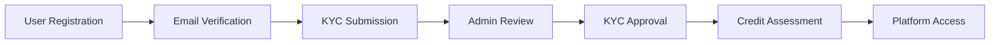
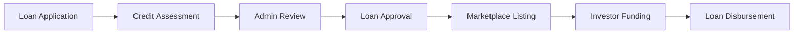
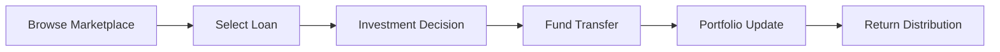
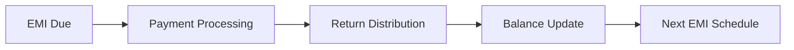

# P2P Lending Platform - Development Overview

## 🎯 Platform Overview

The P2P Lending Platform is a comprehensive financial technology solution that connects borrowers with investors through a secure, scalable marketplace. Built with modern microservices architecture, it enables efficient loan origination, investment management, and automated repayment processing.

## 🏗️ Architecture Summary

### Technology Stack
- **Backend**: NestJS (Microservices Architecture)
- **Databases**: PostgreSQL (Primary), MongoDB (Notifications), Redis (Caching)
- **Message Broker**: RabbitMQ (Event-driven communication)
- **Authentication**: JWT with refresh token rotation
- **API Documentation**: Swagger/OpenAPI
- **Testing**: Jest, Supertest
- **Monitoring**: Grafana, Prometheus
- **Deployment**: Docker, Kubernetes

### Service Architecture
```
┌─────────────────┐    ┌─────────────────┐    ┌─────────────────┐
│   API Gateway   │    │   Auth Service  │    │  User Service   │
│   (Port 3000)   │    │   (Port 3001)   │    │   (Port 3002)   │
└─────────────────┘    └─────────────────┘    └─────────────────┘
         │                       │                       │
         └───────────────────────┼───────────────────────┘
                                 │
                    ┌─────────────────┐
                    │    RabbitMQ     │
                    │   (Port 5672)   │
                    └─────────────────┘
                                 │
         ┌───────────────────────┼───────────────────────┐
         │                       │                       │
┌─────────────────┐    ┌─────────────────┐    ┌─────────────────┐
│  Loan Service   │    │Investment Service│    │Payment Service  │
│   (Port 3003)   │    │   (Port 3004)   │    │   (Port 3005)   │
└─────────────────┘    └─────────────────┘    └─────────────────┘
         │                       │                       │
         └───────────────────────┼───────────────────────┘
                                 │
                    ┌─────────────────┐
                    │Notification Svc │
                    │   (Port 3006)   │
                    └─────────────────┘
```

## 🔄 Core Business Flows

### 1. User Onboarding Flow


### 2. Loan Origination Flow


### 3. Investment Flow


### 4. Repayment Flow


## 📊 Key Features

### For Borrowers
- **Loan Application**: Easy-to-use loan application form with real-time calculations
- **Credit Assessment**: Automated credit scoring based on KYC and financial data
- **Marketplace Listing**: Approved loans listed for investor funding
- **Repayment Management**: Automated EMI processing and payment tracking
- **Dashboard**: Real-time loan status and payment history

### For Investors
- **Marketplace Browsing**: Filter and search available loan opportunities
- **Risk Assessment**: Detailed borrower profiles and credit scores
- **Portfolio Management**: Track investments and returns across multiple loans
- **Diversification Tools**: Investment recommendations based on risk tolerance
- **Return Tracking**: Real-time performance metrics and return calculations

### For Administrators
- **KYC Management**: Review and approve user identity verification
- **Loan Review**: Approve or reject loan applications
- **Risk Management**: Monitor platform risk and compliance
- **Analytics Dashboard**: Platform performance and user activity metrics
- **Compliance Reporting**: Automated regulatory reporting

## 🛠️ Development Phases

### Phase 1: Foundation (Completed)
- ✅ Project setup and configuration
- ✅ Authentication and authorization system
- ✅ User management and KYC workflows
- ✅ Basic API Gateway implementation

### Phase 2: Core Services (In Progress)
- ✅ Loan Service with CQRS pattern
- 🔄 Investment Service implementation
- 🔄 Payment Service integration
- 🔄 Notification Service setup

### Phase 3: Advanced Features (Planned)
- 📋 Advanced risk assessment algorithms
- 📋 Automated compliance reporting
- 📋 Mobile application development
- 📋 Advanced analytics and reporting

### Phase 4: Production Readiness (Planned)
- 📋 Performance optimization
- 📋 Security hardening
- 📋 Monitoring and alerting
- 📋 Disaster recovery setup

## 🔧 Development Guidelines

### Code Organization
```
apps/
├── api-gateway/          # API Gateway service
├── auth-service/         # Authentication service
├── user-service/         # User management service
├── loan-service/         # Loan origination service
├── investment-service/   # Investment management service
├── payment-service/      # Payment processing service
└── notification-service/ # Notification service

libs/
├── common/              # Shared utilities and types
├── database/            # Database schemas and migrations
├── dto/                 # Data transfer objects
├── guards/              # Authentication guards
├── interceptors/        # Request/response interceptors
└── pipes/               # Validation pipes
```

### Message Patterns
All inter-service communication follows a consistent pattern:
```typescript
// Request pattern: service.action
'user.create'
'loan.approve'
'investment.create'

// Response pattern: service.action.response
'user.create.response'
'loan.approve.response'
'investment.create.response'
```

### Database Design
- **PostgreSQL**: Primary database for transactional data
- **MongoDB**: Document storage for notifications and logs
- **Redis**: Caching and session management
- **Prisma**: Database ORM with type-safe queries

### Security Implementation
- **JWT Authentication**: Stateless authentication with refresh tokens
- **Role-Based Access Control**: Granular permissions for different user types
- **Data Encryption**: Sensitive data encrypted at rest and in transit
- **Audit Logging**: Complete audit trail for all financial operations

## 📈 Performance Considerations

### Scalability
- **Horizontal Scaling**: Services designed to scale independently
- **Load Balancing**: API Gateway distributes requests across service instances
- **Database Sharding**: Planned for high-volume data scenarios
- **Caching Strategy**: Redis caching for frequently accessed data

### Monitoring
- **Health Checks**: Service health monitoring and alerting
- **Performance Metrics**: Response time and throughput monitoring
- **Error Tracking**: Comprehensive error logging and alerting
- **Business Metrics**: Loan volume, investment tracking, and user activity

## 🚀 Getting Started

### Prerequisites
- Node.js 18+
- PostgreSQL 14+
- MongoDB 5+
- Redis 6+
- RabbitMQ 3.8+

### Development Setup
```bash
# Clone repository
git clone <repository-url>
cd p2p-lending-services

# Install dependencies
npm install

# Setup databases
npm run db:setup

# Start development servers
npm run start:dev

# Run tests
npm run test
```

### Service Endpoints
- **API Gateway**: http://localhost:3000
- **Auth Service**: http://localhost:3001
- **User Service**: http://localhost:3002
- **Loan Service**: http://localhost:3003
- **Investment Service**: http://localhost:3004
- **Payment Service**: http://localhost:3005
- **Notification Service**: http://localhost:3006

## 📚 Documentation

### Architecture Documents
- [Complete System Architecture](./bussiness-logic/p2p-lending-platform-architecture.md)
- [Authentication Flow](./bussiness-logic/auth-architecture.md)
- [API Gateway Structure](./api-gateway-structure.md)
- [RabbitMQ Best Practices](./rmq-interface-best-practices.md)

### Development Guides
- [Development Rules](./p2p-lending-services.rules.md)
- [Project Plans](./plans.md)
- [Database Schema](./ERD-diagram/)

### API Documentation
- Swagger UI available at: http://localhost:3000/api/docs
- Postman collection available in `/docs/postman/`

## 🔍 Testing Strategy

### Unit Testing
- Service layer testing with mocked dependencies
- Repository pattern testing with in-memory databases
- Utility function testing with comprehensive test cases

### Integration Testing
- API endpoint testing with real database connections
- Message queue testing with test RabbitMQ instances
- Cross-service communication testing

### End-to-End Testing
- Complete user journey testing
- Business flow validation
- Performance and load testing

## 🚨 Security Considerations

### Financial Security
- **Fund Protection**: Investor funds held in secure escrow accounts
- **Transaction Security**: All financial transactions encrypted and verified
- **Fraud Prevention**: Automated fraud detection and prevention systems
- **Compliance**: KYC/AML compliance and regulatory reporting

### Data Security
- **Encryption**: Data encrypted at rest and in transit
- **Access Control**: Role-based access control with principle of least privilege
- **Audit Trails**: Complete audit logging for all operations
- **Privacy**: GDPR compliance with data anonymization

## 📊 Business Metrics

### Key Performance Indicators
- **Loan Volume**: Total loans originated and funded
- **Investment Volume**: Total investments made by lenders
- **Default Rate**: Percentage of loans in default
- **User Growth**: New borrower and investor registrations
- **Platform Revenue**: Fees generated from successful transactions

### Monitoring Dashboard
- Real-time platform metrics
- User activity and engagement
- Financial performance indicators
- System health and performance
- Compliance and risk metrics

---

*This development overview provides a comprehensive understanding of the P2P Lending Platform architecture, features, and development approach for the development team.*
