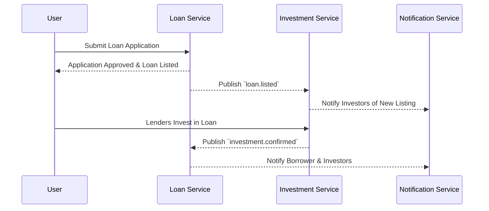

# 🏦 Loan Platform - Microservices Architecture

This document explains the architecture and core features of the loan platform, focusing on **loan listing**, **investment**, **repayment**, and **notifications**.

---

## **1. Overview**

The platform allows users to:
- Apply for loans
- Invest in available loan listings
- Manage repayments automatically
- Receive real-time updates and notifications

### **Tech Stack**
- **Backend**: NestJS (Microservices)
- **Databases**: PostgreSQL + MongoDB
- **Communication**: RabbitMQ (Event-driven)
- **Frontend**: React
- **Authentication**: JWT + Passport

---

## **2. Microservices**

### **2.1 User Service**
- **Responsibilities**
  - Manage users, roles, and permissions
  - Handle KYC documents & verification
  - Expose REST + gRPC endpoints for authentication
- **Database**: PostgreSQL
- **Events Consumed**
  - `user.kyc.verified` → triggers loan eligibility update
- **Events Published**
  - `user.registered`
  - `user.kyc.verified`

---

### **2.2 Loan Service**
Handles **loan origination**, **loan listings**, and **investment management**.

- **Responsibilities**
  - Create and manage loan applications
  - List approved loans for investment
  - Track investors and funding progress
  - Generate loan repayment schedules
- **Database**: PostgreSQL
- **Events Consumed**
  - `payment.repaid` → update loan balance & close loan if fully repaid
- **Events Published**
  - `loan.created`
  - `loan.approved`
  - `loan.listed`
  - `loan.funded`
  - `loan.closed`

---

### **2.3 Investment Service**
- **Responsibilities**
  - Allow users (lenders) to invest in active loan listings
  - Maintain investor portfolios
  - Lock funds until loan is funded or rejected
- **Database**: PostgreSQL
- **Events Consumed**
  - `loan.listed` → open investments for the loan
- **Events Published**
  - `investment.created`
  - `investment.cancelled`
  - `investment.confirmed`

---

### **2.4 Payment Service**
- **Responsibilities**
  - Handles **repayment scheduling** and **auto-debits**
  - Manages late payment penalties and settlements
  - Integrates with third-party payment gateways
- **Database**: PostgreSQL
- **Events Consumed**
  - `loan.funded` → start repayment schedule
- **Events Published**
  - `payment.initiated`
  - `payment.repaid`
  - `payment.failed`

---

### **2.5 Notification Service**
- **Responsibilities**
  - Sends **email**, **SMS**, and **in-app notifications**
  - Uses **MongoDB** to store logs
- **Triggers**
  - `loan.listed` → notify potential investors
  - `investment.confirmed` → notify lender & borrower
  - `payment.repaid` → notify both parties

---

### **2.6 API Gateway**
- **Responsibilities**
  - Central entry point for all client requests
  - Handles authentication, rate limiting, and routing
  - Aggregates responses from multiple services

---

### **2.7 RabbitMQ (Event Broker)**
- **Responsibilities**
  - Enables **asynchronous communication** between services
  - Ensures services are **loosely coupled** and **scalable**
- **Exchange Types**
  - `fanout`: For broadcasting events (e.g., `loan.listed`)
  - `direct`: For targeted service-to-service messages (e.g., `payment.initiated`)

---

## **3. Core Features**

### **3.1 Loan Listing Flow**

---

## **4. Database Schema**

### **4.1 Core Tables**
- **users**: User profiles and KYC information
- **loans**: Loan applications and status
- **investments**: Lender commitments to loans
- **repayments**: Payment schedules and history
- **notifications**: Communication logs

### **4.2 Key Relationships**
- User → Loans (One-to-Many)
- Loan → Investments (One-to-Many)
- Loan → Repayments (One-to-Many)
- User → Notifications (One-to-Many)

---

## **5. Security & Compliance**

### **5.1 Data Protection**
- Encrypted storage for sensitive information
- Role-based access control
- Audit logging for all operations

### **5.2 Financial Security**
- Transaction signing for high-value operations
- Rate limiting on financial endpoints
- Fraud detection patterns

---

## **6. Performance & Scalability**

### **6.1 Caching Strategy**
- Redis for session management
- Database query optimization
- Connection pooling

### **6.2 Monitoring**
- Health checks for all services
- Performance metrics tracking
- Error rate monitoring

---

This architecture provides a robust foundation for a P2P lending platform with clear service boundaries, event-driven communication, and comprehensive security measures.

  