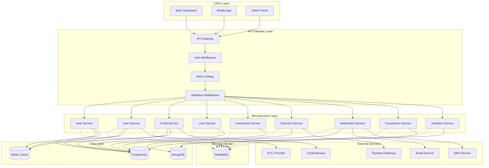
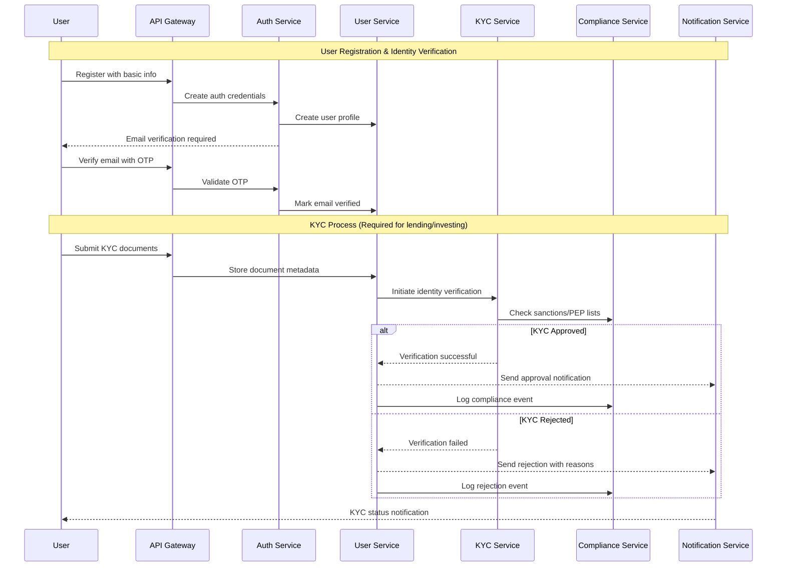
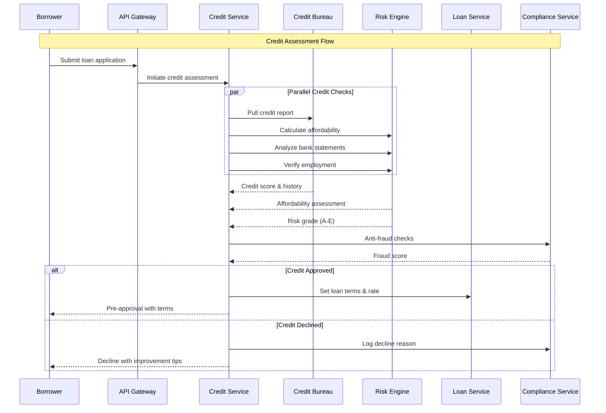
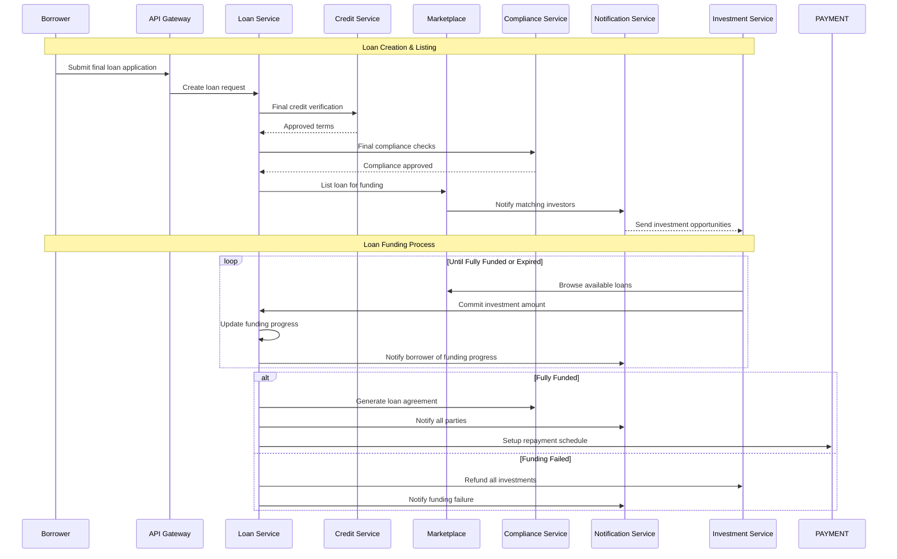
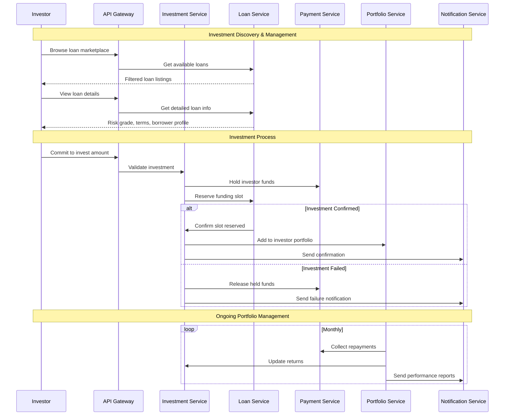
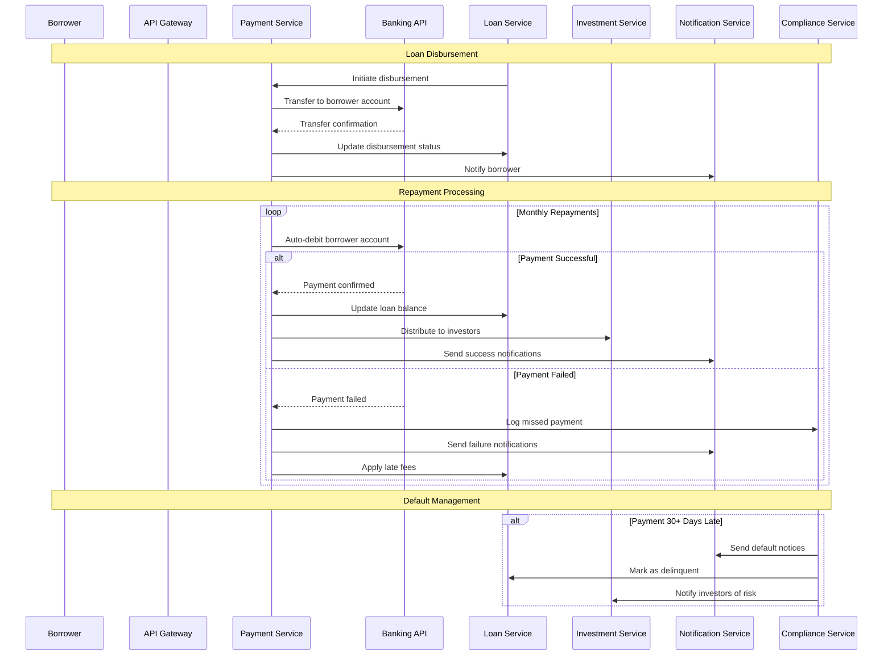
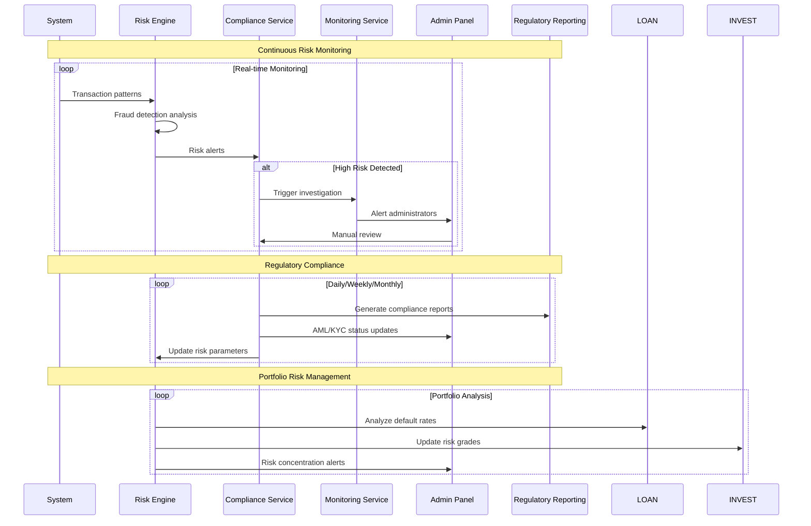
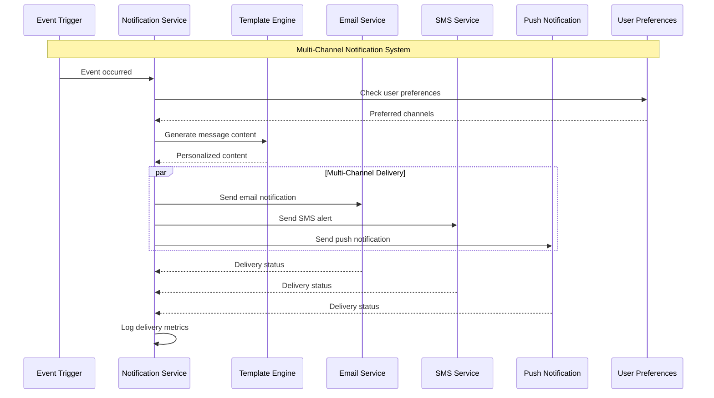
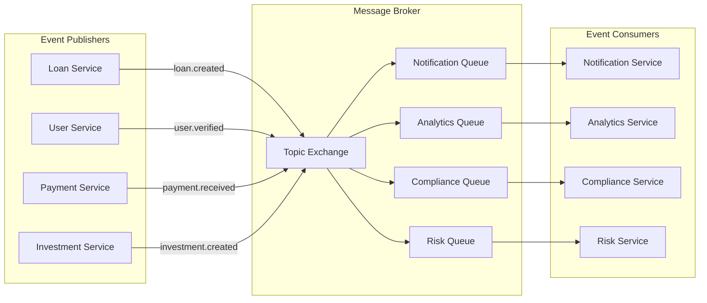

# 🏦 P2P Lending Platform - Complete System Flow & Architecture

> **Modern P2P lending platform built with NestJS microservices, RabbitMQ, PostgreSQL, and React following real-world industry best practices.**

---

## 📋 Table of Contents

1. [System Overview](#system-overview)
2. [Authentication & KYC Flow](#authentication--kyc-flow)
3. [Credit Assessment & Risk Management](#credit-assessment--risk-management)
4. [Loan Origination Flow](#loan-origination-flow)
5. [Investment & Marketplace Flow](#investment--marketplace-flow)
6. [Payment & Repayment Flow](#payment--repayment-flow)
7. [Risk Management & Compliance](#risk-management--compliance)
8. [Notification & Communication](#notification--communication)
9. [Architecture & Event Patterns](#architecture--event-patterns)
10. [Real-World Best Practices](#real-world-best-practices)

---

## 🏗️ System Overview



---

## 🔐 Authentication & KYC Flow



---

## 📊 Credit Assessment & Risk Management



---

## 💰 Loan Origination Flow



---

## 🔄 Investment & Marketplace Flow



---

## 💳 Payment & Repayment Flow



---

## ⚖️ Risk Management & Compliance



---

## 📱 Notification & Communication



---

## 🏗️ Architecture & Event Patterns

### Message Patterns

```typescript
export const MESSAGE_PATTERNS = {
  // Authentication & User Management
  AUTH: {
    REGISTER: 'auth.register',
    LOGIN: 'auth.login',
    VALIDATE_TOKEN: 'auth.validate_token',
    REFRESH_TOKEN: 'auth.refresh_token',
    LOGOUT: 'auth.logout',
  },
  
  // User & KYC Management
  USER: {
    CREATE_PROFILE: 'user.create_profile',
    UPDATE_PROFILE: 'user.update_profile',
    SUBMIT_KYC: 'user.submit_kyc',
    VERIFY_IDENTITY: 'user.verify_identity',
  },
  
  // Credit Assessment
  CREDIT: {
    ASSESS_CREDITWORTHINESS: 'credit.assess',
    UPDATE_CREDIT_SCORE: 'credit.update_score',
    FRAUD_CHECK: 'credit.fraud_check',
  },
  
  // Loan Management
  LOAN: {
    CREATE_APPLICATION: 'loan.create_application',
    APPROVE_LOAN: 'loan.approve',
    LIST_FOR_FUNDING: 'loan.list_for_funding',
    FUND_LOAN: 'loan.fund',
    DISBURSE_LOAN: 'loan.disburse',
    UPDATE_REPAYMENT: 'loan.update_repayment',
  },
  
  // Investment Management
  INVESTMENT: {
    CREATE_INVESTMENT: 'investment.create',
    CANCEL_INVESTMENT: 'investment.cancel',
    DISTRIBUTE_RETURNS: 'investment.distribute_returns',
  },
  
  // Payment Processing
  PAYMENT: {
    PROCESS_PAYMENT: 'payment.process',
    SETUP_AUTO_DEBIT: 'payment.setup_auto_debit',
    HANDLE_FAILED_PAYMENT: 'payment.handle_failed',
    DISBURSE_FUNDS: 'payment.disburse',
  },
  
  // Compliance & Risk
  COMPLIANCE: {
    KYC_VERIFICATION: 'compliance.kyc_verification',
    AML_CHECK: 'compliance.aml_check',
    FRAUD_ALERT: 'compliance.fraud_alert',
    REGULATORY_REPORT: 'compliance.regulatory_report',
  },
  
  // Events for Pub/Sub
  EVENTS: {
    USER_REGISTERED: 'event.user.registered',
    KYC_APPROVED: 'event.kyc.approved',
    KYC_REJECTED: 'event.kyc.rejected',
    LOAN_APPLIED: 'event.loan.applied',
    LOAN_APPROVED: 'event.loan.approved',
    LOAN_FUNDED: 'event.loan.funded',
    LOAN_DISBURSED: 'event.loan.disbursed',
    PAYMENT_RECEIVED: 'event.payment.received',
    PAYMENT_FAILED: 'event.payment.failed',
    INVESTMENT_CREATED: 'event.investment.created',
    RETURNS_DISTRIBUTED: 'event.returns.distributed',
  },
  
  // Notifications
  NOTIFICATION: {
    SEND_EMAIL: 'notification.send_email',
    SEND_SMS: 'notification.send_sms',
    SEND_PUSH: 'notification.send_push',
  },
} as const;
```

### Event-Driven Architecture



---

## 🌟 Real-World Best Practices

### 1. **Security & Compliance**
- **Multi-layer Authentication**: 2FA, biometric verification, device fingerprinting
- **PCI DSS Compliance**: For payment processing
- **GDPR/CCPA Compliance**: Data privacy and user rights
- **Regular Security Audits**: Penetration testing, vulnerability assessments
- **Encryption**: End-to-end encryption for sensitive data

### 2. **Risk Management**
- **Real-time Fraud Detection**: ML-based anomaly detection
- **Credit Scoring Models**: Multiple data sources, alternative credit data
- **Portfolio Diversification**: Limits on concentration risk
- **Stress Testing**: Regular portfolio stress tests
- **Default Prediction**: Early warning systems

### 3. **User Experience**
- **Intuitive Dashboard**: Clean, responsive design
- **Mobile-First Approach**: Progressive Web App (PWA)
- **Real-time Updates**: WebSocket connections for live data
- **Personalized Recommendations**: AI-driven investment suggestions
- **Educational Content**: Financial literacy resources

### 4. **Operational Excellence**
- **Microservices Architecture**: Independent scaling and deployment
- **Circuit Breakers**: Fault tolerance and resilience
- **Health Checks**: Comprehensive monitoring and alerting
- **Auto-scaling**: Dynamic resource allocation
- **Blue-Green Deployments**: Zero-downtime deployments

### 5. **Regulatory Compliance**
- **Know Your Customer (KYC)**: Identity verification workflows
- **Anti-Money Laundering (AML)**: Transaction monitoring
- **Fair Lending**: Non-discriminatory lending practices
- **Data Retention**: Compliant data lifecycle management
- **Audit Trails**: Comprehensive logging and tracking

### 6. **Performance & Scalability**
- **Caching Strategy**: Redis for session and application caching
- **Database Optimization**: Read replicas, query optimization
- **CDN Integration**: Global content delivery
- **Load Balancing**: Distribute traffic across services
- **Asynchronous Processing**: Queue-based background jobs

### 7. **Business Intelligence**
- **Real-time Analytics**: Business metrics and KPIs
- **Predictive Analytics**: Risk modeling and forecasting
- **A/B Testing**: Feature experimentation
- **Cohort Analysis**: User behavior tracking
- **Automated Reporting**: Stakeholder dashboards

---

## 📊 Key Performance Indicators (KPIs)

| Category | Metric | Target | Description |
|----------|--------|--------|-------------|
| **Operational** | Platform Uptime | 99.9% | System availability |
| **Operational** | API Response Time | <200ms | Average response time |
| **Business** | Monthly Active Users | Growth | User engagement |
| **Business** | Loan Approval Rate | 15-25% | Credit quality balance |
| **Risk** | Default Rate | <5% | Portfolio performance |
| **Risk** | Fraud Detection Rate | >95% | Security effectiveness |
| **Financial** | Net Promoter Score | >50 | Customer satisfaction |
| **Financial** | Revenue Growth | >20% YoY | Business growth |

---

## 🔧 Technology Stack

| Layer | Technology | Purpose |
|-------|------------|---------|
| **Frontend** | React, TypeScript, Tailwind CSS | User interface |
| **API Gateway** | NestJS, Express | Request routing & validation |
| **Microservices** | NestJS, TypeScript | Business logic |
| **Message Broker** | RabbitMQ | Asynchronous communication |
| **Databases** | PostgreSQL, MongoDB, Redis | Data persistence & caching |
| **Authentication** | JWT, Passport.js | Security & authorization |
| **Monitoring** | Prometheus, Grafana | System monitoring |
| **Logging** | ELK Stack | Centralized logging |
| **Deployment** | Docker, Kubernetes | Containerization & orchestration |
| **CI/CD** | GitHub Actions, ArgoCD | Automated deployment |

---

This comprehensive documentation follows real-world P2P lending platform best practices, incorporating industry-standard security, compliance, and operational patterns used by successful platforms like LendingClub, Prosper, and modern fintech solutions.
